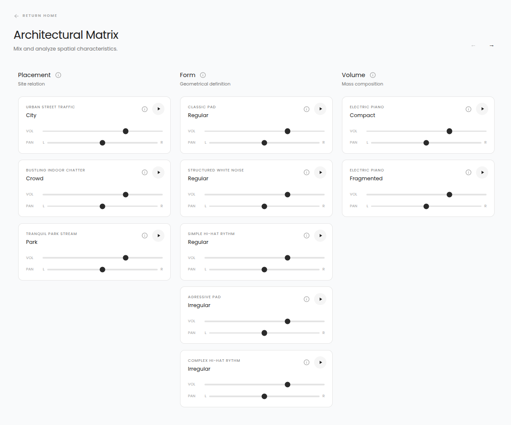
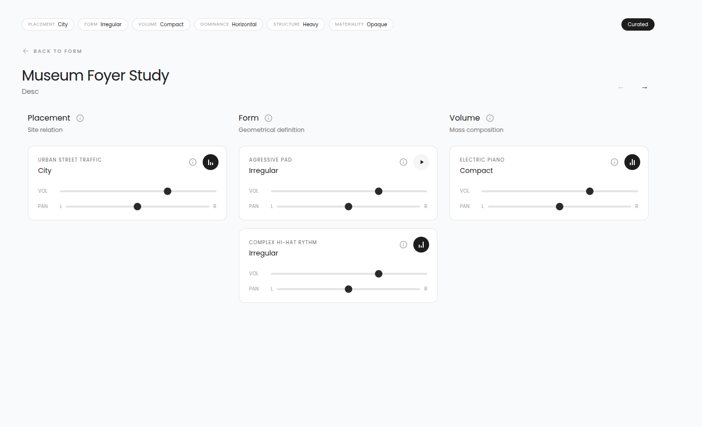

# Vibraspace

Vibraspace is a React app for the **Composing Atmospheres** architecture workshop. The app should be available at [composingatmospheres.ro](https://composingatmospheres.ro/)

This project supports a **PhD in Architecture** research thesis, for which I served as the lead developer and programmer who built the full-stack Vibraspace application.

Beyond engineering, I also composed and produced all the original ambient sound tracks available. A short demo of the compositions only is available [here](https://www.youtube.com/watch?v=VkiRsRmau30).


## What The App Contains

- **Home**: introduction and links to the main areas.

- **Theory**: written framework for the relationship between architecture, perception, and sound.

- **Workshop**: description of Studio 46 and a gallery of student projects.

- **Workshop Project**: one project page with image, description, and audio playback.

- **Mixer**: a free audio matrix where anyone can play and combine architectural sound tracks.

- **Session Form**: asks for a project name, 
description, and architectural parameters.

- **Session Mixer**: creates a curated mixer from the form choices, records 45 seconds, and saves the result.

## Mixer & Session Mixer

### Mixer
Route: `/mixer`

The regular Mixer is an open playground. It loads all categories from `src/data/columns_data.json` and shows them in a carousel-style grid.

Each track can be:

- played or paused
- adjusted by volume
- adjusted by stereo pan
- opened for more architectural and musical information

This mixer does not save anything. It is mainly for exploration.



### Session Mixer

Route: `/session-mixer`

The Session Mixer is used after the user fills in `/session-form`.

The form sends:

- project name
- optional project description
- one selected value for each architectural category

By default, the Session Mixer only shows tracks that match those selections. The user can switch between:

- **Curated**: only the selected architectural tracks
- **All tracks**: the full mixer data

When the user submits, the app records 45 seconds of the current mix. It sends the project data, track state, and audio file to the backend.

Saved sessions are stored in SQLite, and audio files are stored in `backend/uploads`.



## Local Development

Install frontend dependencies:

```bash
npm install
```

Install backend dependencies:

```bash
cd backend
npm install
```

Start the backend:

```bash
cd backend
npm run dev
```

In a second terminal, start the frontend:

```bash
npm run dev
```

The app runs at `http://localhost:5173`.

The backend runs at `http://localhost:3001`.

The Vite development server proxies `/api` requests to the backend.

## Backend API

### `POST /api/sessions`

Creates a recorded workshop session.

Expected multipart form fields:

| Field | Description |
| --- | --- |
| `projectName` | Required project name |
| `projectDescription` | Optional project description |
| `formData` | JSON object containing selected architectural values |
| `trackStates` | JSON object containing mixer state |
| `audio` | Optional recorded audio file |

### `GET /api/sessions`

Returns all saved sessions without full track state.

### `GET /api/sessions/:id`

Returns one saved session with full form data and track state.

### `GET /api/sessions/:id/audio`

Streams the saved audio file for one session.

## Data Storage

Session metadata is stored in:

```text
backend/sessions.db
```

Uploaded recordings are stored in:

```text
backend/uploads/
```

Useful SQLite query:

```sql
SELECT id, project_name, description, audio_file, created_at
FROM sessions
ORDER BY created_at DESC;
```

## Scripts

Frontend scripts:

```bash
npm run dev
npm run build
npm run preview
npm run lint
```

Backend scripts:

```bash
cd backend
npm run dev
npm start
```

## Environment Variables

| Variable | Default | Description |
| --- | --- | --- |
| `PORT` | `3001` | Backend server port |
| `FRONTEND_URL` | `http://localhost:5173` | Allowed CORS origin |

## Production

Build the frontend:

```bash
npm run build
```

Start the backend:

```bash
cd backend
npm start
```

When the frontend has been built, the backend serves the generated `dist/`
directory and falls back to `index.html` for client-side routes.

## First-Time Deployment

These steps assume the server already has Node.js, npm, Git, Caddy, and PM2
installed.

Clone the project:

```bash
git clone <repo-url>
cd vibraspace
```

Install and build the frontend:

```bash
npm install
npm run build
```

Install backend dependencies:

```bash
cd backend
npm install
```

Start the backend with PM2:

```bash
pm2 start server.js --name vibraspace
pm2 save
```

Configure Caddy:

```caddyfile
composingatmospheres.ro {
    reverse_proxy localhost:3001
}
```

Reload Caddy after updating the Caddyfile:

```bash
sudo systemctl reload caddy
```

The site should now be available at:

```text
https://composingatmospheres.ro
```

## Update Deployment

Pull the latest code:

```bash
git pull
```

Reinstall dependencies if `package.json` or a lockfile changed:

```bash
npm install
cd backend
npm install
cd ..
```

Rebuild the frontend:

```bash
npm run build
```

Restart the backend process:

```bash
pm2 restart vibraspace
pm2 save
```

Check the running process:

```bash
pm2 status
```

If PM2 shows duplicate `vibraspace` processes, delete the extra process by id
and save the corrected list:

```bash
pm2 delete <id>
pm2 save
```

## Checks

Run these before committing changes:

```bash
npm run lint
npm run build
node --check backend/server.js
```
